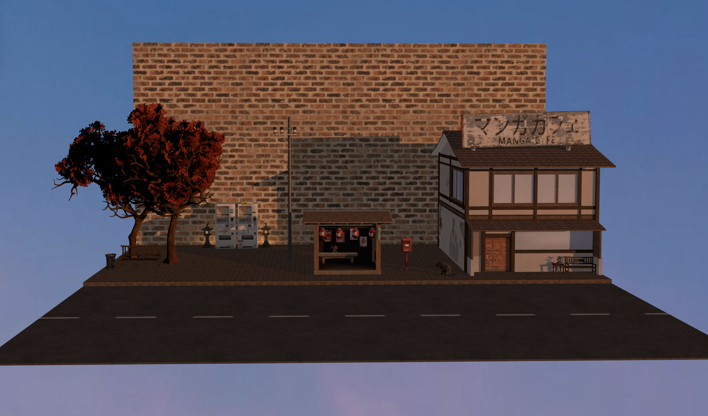

# Kyoto Bus Stop - Progetto Computer Graphics

"Kyoto Bus Stop" è un'applicazione web interattiva 3D sviluppata in **Three.js**. Il progetto rappresenta una fermata dell'autobus lungo una strada giapponese al tramonto. L'estetica si ispira ai classici diorami in stile anime, combinando modelli 3D ottimizzati in Blender, illuminazione dinamica e un sistema di interazione utente.

## Screenshot della Scena


## Live Demo e Local Download
Il progetto è pubblicato e consultabile in tempo reale al seguente link
[https://giordu.github.io/kyotobusstop/]

Per eseguirlo in locale (Node.js):
```bash
   git clone [https://github.com/giordu/kyotobusstop.git]
   npm run build
   npx serve